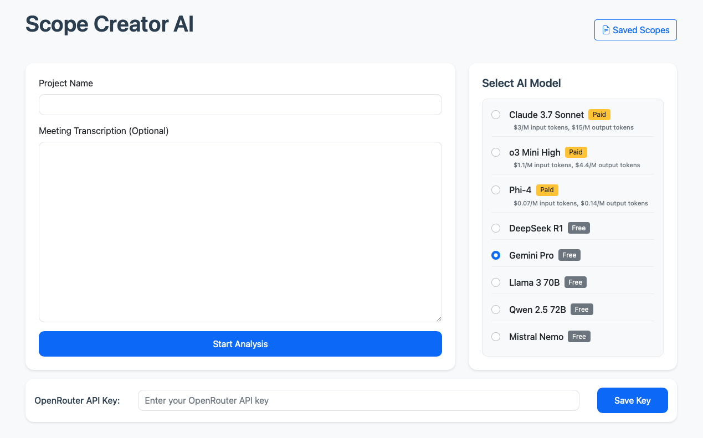

# Scope Creator



Scope Creator is an AI-powered application that helps you create comprehensive project scope documents. It uses advanced AI models to analyze your project information and generate detailed scope documents that can be edited, saved, and versioned.

## Features

- Create detailed scope documents from minimal project information
- Save and version your scope documents
- Edit and update scope documents with AI assistance
- View version history and restore previous versions
- Access your scope documents from anywhere

## Prerequisites

Before setting up Scope Creator, make sure you have:

1. Python 3.6 or higher installed
2. An OpenRouter API key (get one at [https://openrouter.ai](https://openrouter.ai))

## Setup

### Automatic Setup (Recommended)

#### On macOS/Linux:

1. Open a terminal in the project directory
2. Make the setup script executable:
   ```
   chmod +x setup.sh
   ```
3. Run the setup script:
   ```
   ./setup.sh
   ```
4. Follow the on-screen instructions

#### On Windows:

1. Open a command prompt in the project directory
2. Run the setup script:
   ```
   setup.bat
   ```
3. Follow the on-screen instructions

### Manual Setup

If you prefer to set up the application manually:

1. Create a virtual environment:
   ```
   python -m venv .venv
   ```

2. Activate the virtual environment:
   - On Windows:
     ```
     .venv\Scripts\activate
     ```
   - On macOS/Linux:
     ```
     source .venv/bin/activate
     ```

3. Install dependencies:
   ```
   pip install -r requirements.txt
   ```

4. Create a `.env` file in the project root with your OpenRouter API key:
   ```
   OPENROUTER_API_KEY=your_api_key_here
   ```

## Running the Application

1. Activate the virtual environment (if not already activated)
2. Start the application:
   ```
   python app.py
   ```
3. Open your web browser and navigate to [http://localhost:5006](http://localhost:5006)

## Usage

1. **Create a New Scope**:
   - Enter your project name
   - Optionally add meeting transcription
   - Answer the AI-generated questions
   - Generate the scope document

2. **View Saved Scopes**:
   - Click on "Saved Scopes" to see all your saved scope documents
   - Open any scope to view its contents

3. **Edit a Scope**:
   - Click "Edit" on any scope
   - Make changes and save them
   - Use the AI assistant to help with specific edits

4. **Version History**:
   - Click "History" on any scope to see all versions
   - View or restore previous versions as needed

## Troubleshooting

- If you encounter issues with the OpenRouter API, ensure your API key is correct and has sufficient credits
- If the application fails to start, check that all dependencies are installed and the virtual environment is activated
- For persistent issues, check the console output for error messages
